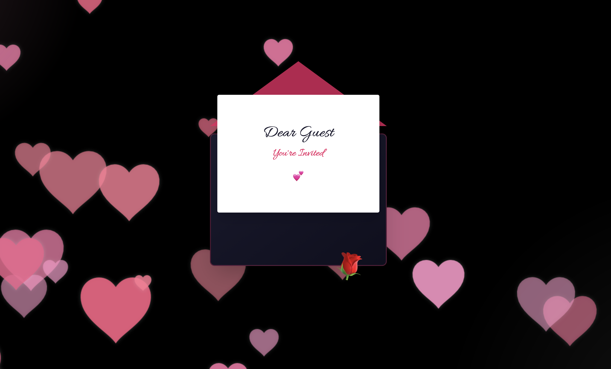
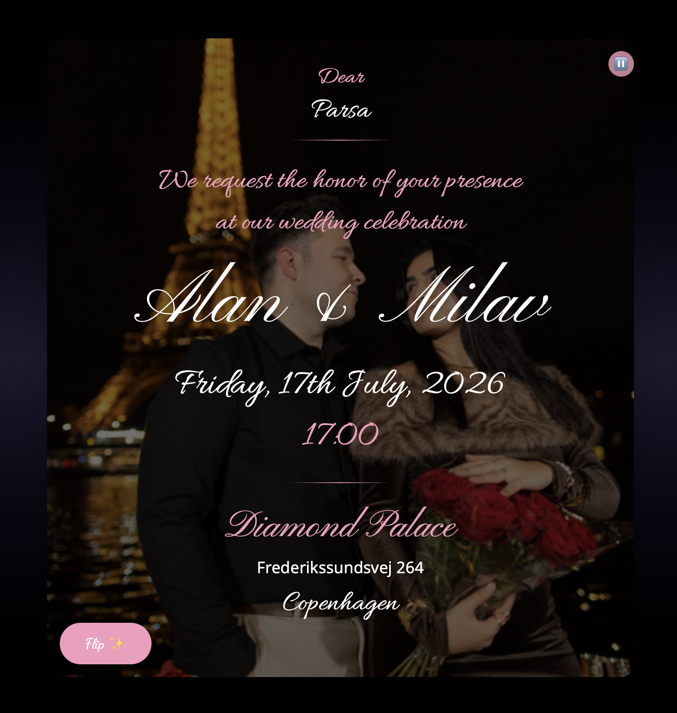
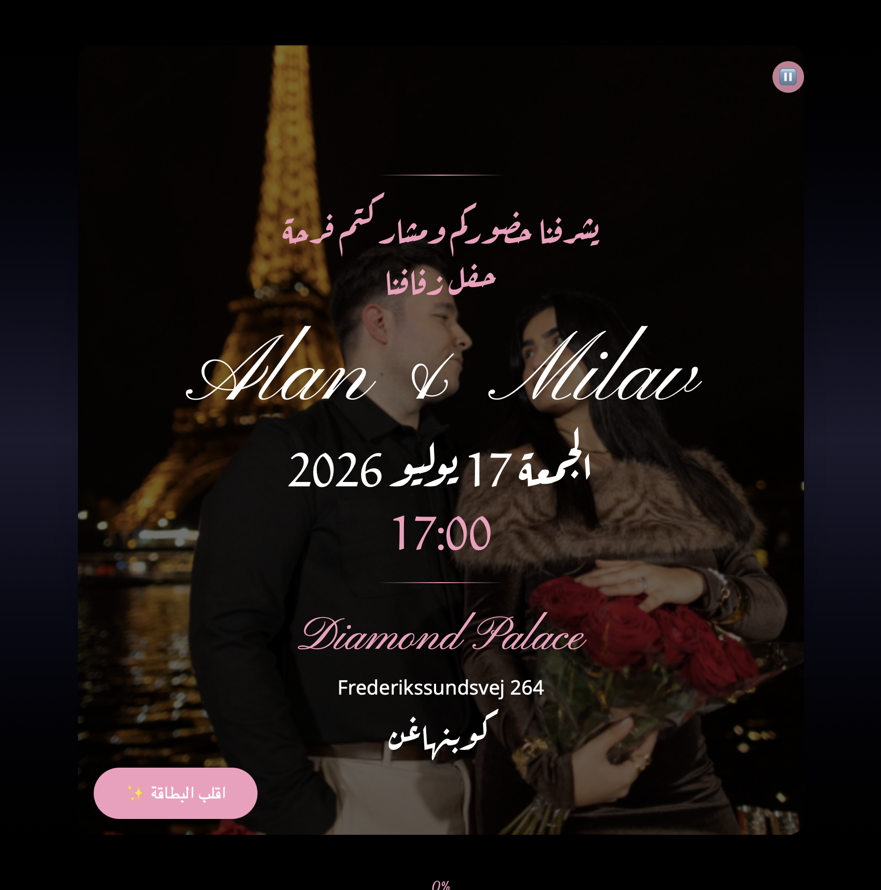
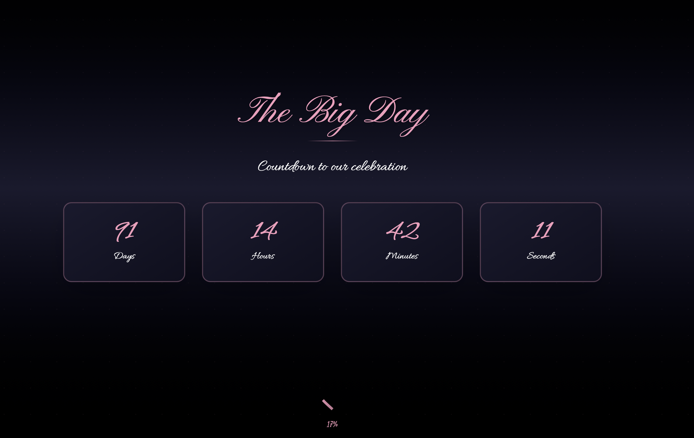
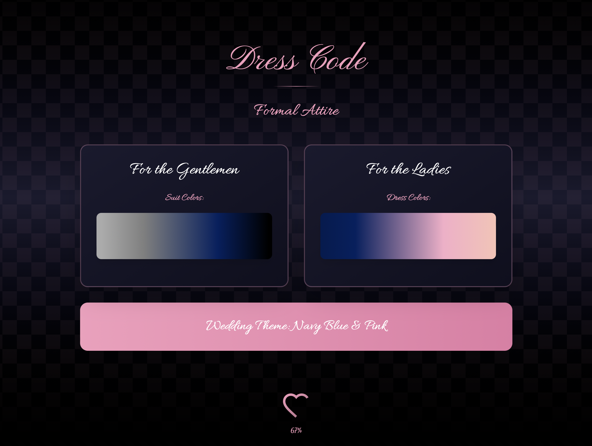

# Wedding Invitation Website 💍✨

This website is something very personal to me — I made it for my own wedding. 🤍

I wanted our invitation to feel more special than a traditional card and to give our guests an experience that felt warm, memorable, and a little magical. ✨ The idea was to build something beautiful and interactive: a place where guests could not only receive the invitation, but also find proper guidelines that simply would not fit on an ordinary invitation card.

I also wanted a space where our guests could always stay updated with the program, important details, or any changes along the way. 🗓️ Instead of everything being fixed on paper, this invitation could grow with the event and remain useful right up to the wedding day.

My fiancée loved the idea from the beginning — especially the playful heart-generating clicks ❤️ and the proposal song that plays when guests open the invitation card. 🎶 Those little touches made it feel even more like *us*, and turned the invitation into a small story rather than just an announcement.

I decided to make this project open source as well, in case it inspires other couples or helps someone else create a digital invitation for their own special day. 🌍💖

Another feature that was very important to me was personalization. The invitation can be customized for a specific guest simply by using their name in the URL, which makes the experience feel even more personal and welcoming. 💌

For example:

`website.com/name`

Since many of our guests speak Arabic, I also added an Arabic version of the invitation. 🌙

For example:

`website.com/ar/اسم`

The original design was made on Figma. 🎨

## Screenshots

Here are a few glimpses of the invitation experience:

## Running the code

Run `npm install` to install the dependencies.

Run `npm run dev` to start the development server.
